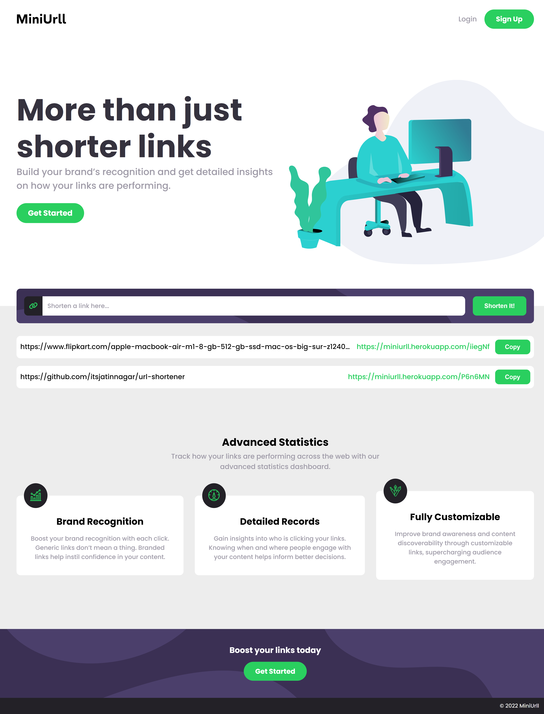

# MiniUrll

## Overview

MiniUrll is a Web Application for shortening URLs.

**Version 1.0**

-   _FetchAPI_ for requesting the server.
-   Browser _Cookies_ for storing and remembering information about urls that user shortened.
-   _JSON_ for sending requests and responses to-and-fro server.

### Built with

-   HTML
-   CSS
-   JavaScript
-   Flask
-   PostgreSQL

### Screenshots

### Live Demo

[https://miniurll.herokuapp.com](https://miniurll.herokuapp.com)

### Useful Resources

[MDN Docs](https://developer.mozilla.org/en-US/) : Best documentation for web technologies including HTML, CSS, JavaScript and many more.

[Flask Documentation](https://flask.palletsprojects.com/en/2.1.x/) : Official Flask documentation.

[W3SCHOOLS](https://www.w3schools.com/) : Best resource to get information on everything about web.

## Author

-   Website - [Jatin Nagar](https://itsjatinnagar.blogspot.com)
-   Twitter - [@itsjatinnagar](https://www.twitter.com/itsjatinnagar)
